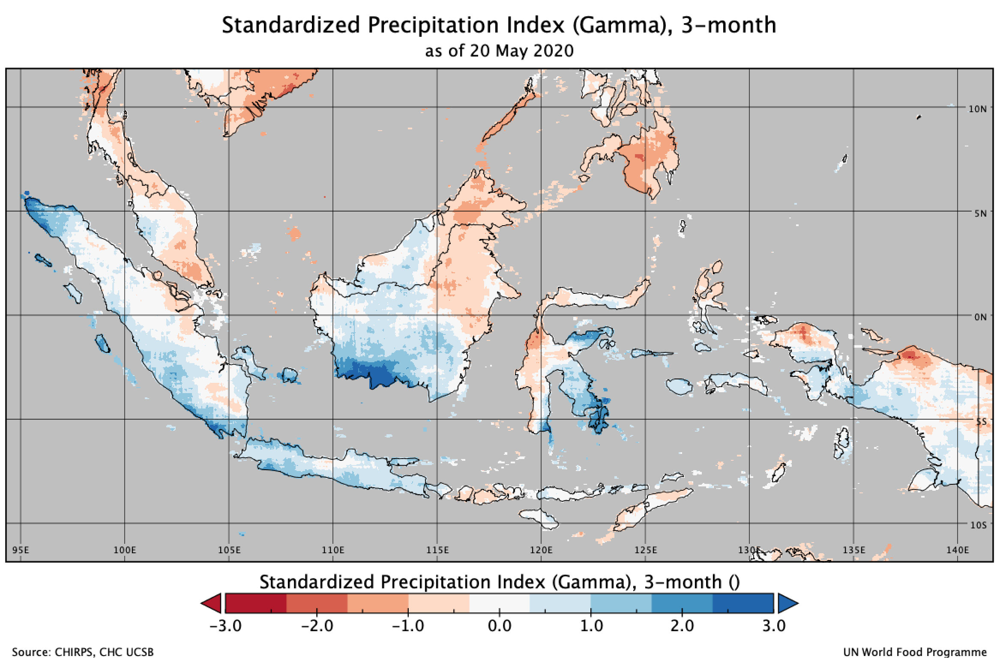

# Background on the SPI

The Standardized Precipitation Index (SPI) is a drought index first developed by T. B. McKee, N.J. Doesken, and J. Kleist and in 1993 ([McKee et al. 1993](https://gmao.gsfc.nasa.gov/research/subseasonal/atlas/SPI-html/SPI-description.html#McKee1993)). The SPI is used for estimating wet or dry condition based on precipitation variable. This wet or dry condition can be monitored by the SPI on a variety of time scales from subseasonal to interannual scales. The SPI is expressed as standard deviations that the observed precipitation would deviate from the long-term mean, for a normal distribution and fitted probability distribution for the actual precipitation record. Since precipitation is not normally distributed, a transformation is first applied, followed by fitting to a normal distribution.

## Calculation

The SPI calculation is based on the long-term precipitation record for a particular location and long-term period (longer than 30 years is desirable). The calculation method is comprised of a transformation of one frequency distribution (e.g., gamma) to another frequency distribution (normal, or Gaussian). The first step to calculate SPI is to adequately choose a particular probability distribution (e.g., gamma distribution, incomplete beta distribution (McKee et al. ([1993](https://gmao.gsfc.nasa.gov/research/subseasonal/atlas/SPI-html/SPI-description.html#McKee1993), [1995](https://gmao.gsfc.nasa.gov/research/subseasonal/atlas/SPI-html/SPI-description.html#McKee1995))), and Pearson III distribution (Guttman ([1998](https://gmao.gsfc.nasa.gov/research/subseasonal/atlas/SPI-html/SPI-description.html#Guttman1998), [1999](https://gmao.gsfc.nasa.gov/research/subseasonal/atlas/SPI-html/SPI-description.html#Guttman1999)))) that reliably fits the long-term precipitation time series and conduct fitting to that distribution. Gamma distribution has been widely used, as the gamma distribution has been understood as the reliable fit to the precipitation distribution. The fitting can be achieved through the maximum likelihood estimation of the gamma distribution parameters. The percentile value from this probability distribution is then transformed to the corresponding value in the new probability distribution. As a result, the probability that the rainfall is less than or equal to any rainfall amount will be the same as the probability that the new variate is less than or equal to the corresponding value of that rainfall amount. The normal distribution is usually used for this another transformation so that the mean and standard deviation of the SPI for a certain station and long-term period is zero and one, respectively ([Edwards and McKee 1997](https://gmao.gsfc.nasa.gov/research/subseasonal/atlas/SPI-html/SPI-description.html#Edwards1997)). Positive SPI values indicate wet condition greater than median precipitation, whereas negative values the dry condition less than median precipitation. More detailed description of the steps required to calculate the SPI is provided in [Lloyd-Hughes and Saunders (2002)](https://gmao.gsfc.nasa.gov/research/subseasonal/atlas/SPI-html/SPI-description.html#Lloyd2002).

## Interpretation

Since the SPI values are obtained from the standard normal distribution, the unit of the SPI can be “standard deviations”. The following table summarizes the cumulative probabilities for various SPI values and possible interpretation of wet (or dry) conditions using the resulting SPI values.

| SPI | Cumulative Probability | Interpretation |
| ----- | ----- | -----|
| -3.0 | 0.0014 | Extremely dry |
| -2.5 | 0.0062 | Extremely dry |
| -2.0 | 0.0228 | Extremely dry (SPI < -2.0) |
| -1.5 | 0.0668 | Severly dry (-2.0 < SPI < -1.5) |
| -1.0 | 0.1587 | Moderately dry (-1.5 < SPI < -1.0) |
| -0.5 | 0.3085 | Near normal |
| 0.0 | 0.5000 | Near normal |
| 0.5 | 0.6915 | Near normal |
| 1.0 | 0.8413 | Moderately wet (1.0 < SPI < 1.5) |
| 1.5 | 0.9332 | Severly wet (1.5 < SPI < 2.0) |
| 2.0 | 0.9772 | Extremely wet (2.0 < SPI <) |
| 2.5 | 0.9938 | Extremely wet |
| 3.0 | 0.9986 | Extremely wet |

The SPI maps can be interpreted at various time scales. This in turn indicates that the SPI is useful in both short-term and long-term applications. These time scales reflect the impact of drought on the availability of the different water resources. For instance, soil moisture conditions respond to precipitation anomalies on a relatively short scale. Groundwater, streamflow, and reservoir storage reflect the longer-term precipitation anomalies. For these reasons, SPI was originally calculated for 3–, 6–,12–, 24–, and 48–month time scales ([McKee et al. (1993)](https://gmao.gsfc.nasa.gov/research/subseasonal/atlas/SPI-html/SPI-description.html#McKee1993)). A separate SPI value can be calculated for a selection of time scales, covering the last months (e.g., 3, 6, 12, 24, and 48 months), and ending on the last day of the latest month.

Source: [https://gmao.gsfc.nasa.gov/research/subseasonal/atlas/SPI-html/SPI-description.html](https://gmao.gsfc.nasa.gov/research/subseasonal/atlas/SPI-html/SPI-description.html)

## Strengths and Limitations

- Used for estimating meteorological conditions based on precipitation alone. 
- Wet or dry conditions can be monitored on a variety of time scales from sub seasonal to interannual 
- Can be compared across regions with markedly difference climates 
- Does not consider the intensity of precipitation and its potential impacts on runoff, streamflow, and water availability 
- Expressed as the number of standard deviations from the long term mean, for a normally distributed random variable, and fitted probability distribution for the actual precipitation record 
- SPI values < 1 indicate a condition of drought, the more negative the value the more severe the drought condition. SPI values > +1 indicate wetter conditions compared to a climatology 

## Example

Expressed as the number of standard deviations from the long-term mean, for a normally distributed random variable, and fitted probability distribution for the actual precipitation record

SPI values < -1 indicate a condition of drought, the more negative the value the more severe the drought condition. SPI values > +1 indicate wetter conditions compared to a climatology

[https://drought.unl.edu/droughtmonitoring/SPI.aspx](https://drought.unl.edu/droughtmonitoring/SPI.aspx)

- SPI 1-month
	
	Similar to a map displaying the percent of normal precipitation for a month. Reflects relatively short term conditions. Its application can be related closely with short term soil moisture and crop stress.

	

- 3 month
	
	Provides a comparison of the precipitation over a specific 3 month period with the precipitation totals from the same 3 month period for all the years included in the historical record. Reflects short and medium term moisture conditions and provides a seasonal estimation of precipitation.

	

- 6 month

	Compares the precipitation for that period with the same 6 month period over the historical record. A 6 month SPI can be very effective in showing the precipitation over distinct seasons and may be associated with anomalous streamflow and reservoir levels.

	

- 9 month

	Provides an indication of precipitation patterns over a medium time scale. SPI values below 1.5 for these time scales are usually a good indication that significant impacts are occurring in agriculture and may be showing up in other sectors as well.

	

- 12 month

	Reflects long term precipitation patterns. Longer SPIs tend toward zero unless a specific trend is taking place. SPIs of these time scales are probably tied to streamflow, reservoir levels, and even groundwater levels at the longer time scales. In some locations of the country, the 12 month SPI is most closely related with the Palmer Index, and the two indices should reflect similar conditions.

	

SPI labels and their relationship to the normal curve. The intensity implied by each label corresponds to the degree of removal from mean conditions (i.e., SPI=0). The percentages printed within the regions bounded by the dashed lines indicate the probability for SPI values to fall within that region only. (Source: [J. Keyantash](https://climatedataguide.ucar.edu/climate-data/standardized-precipitation-index-spi))