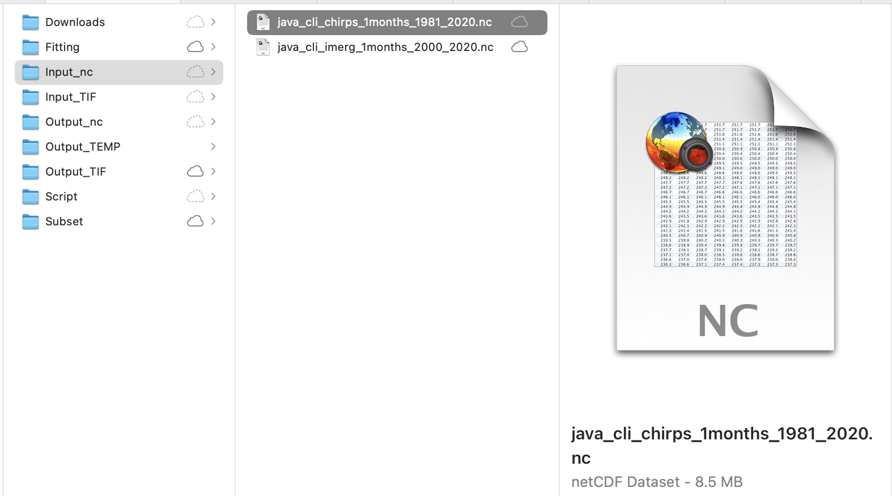

# 3.2. CHIRPS monthly in GeoTIFF format

This section will explain on how to download CHIRPS [monthly data in GeoTIFF](https://data.chc.ucsb.edu/products/CHIRPS-2.0/global_monthly/tifs/) format and prepare it as input for SPI calculation.

- Make sure you still inside conda `gis` environment


## Download CHIRPS data

- Navigate to `Downloads/CHIRPS/GeoTIFF` folder in the working directory. Download using `wget` all CHIRPS monthly data in GeoTIFF format from Jan 1981 to Dec 2020 (this is lot of data +-7GB zipped files, and become 27GB after extraction, please make sure you have bandwidth and unlimited data package). Paste and Enter below script in your Terminal.

```bash
export URL='https://data.chc.ucsb.edu/products/CHIRPS-2.0/global_monthly/tifs/'; curl "$URL" | grep -E 'a href=' | perl -pe 's|.*href="(.*?)".*|\1|' | { while read -r f; do wget "$URL"/"$f"; done }
```


- Gunzip all the downloaded files

```bash
gunzip *.gz
```


## Clip data using a shapefile based on area of interest

- Download the Java boundary shapefile [https://github.com/wfpidn/SPI/blob/master/Data/Subset/java_bnd_chirps_subset.zip](https://github.com/wfpidn/SPI/blob/master/Data/Subset/java_bnd_chirps_subset.zip). And save it in Subset directory then unzip it.

!!! info
    You can use your own boundary in shapefile and use it to clip the rainfall raster data based on your preferred area of interest.

- Still in your `GeoTIFF` directory, Clip your area of interest using Java boundary and save it to `Input_TIF` directory. I will use `gdalwarp` command from GDAL to clip all GeoTIFF files in a folder.

```bash
for i in `find *.tif`; do gdalwarp --config GDALWARP_IGNORE_BAD_CUTLINE YES -srcnodata NoData -dstnodata -9999 -cutline ../../../Subset/java_bnd_chirps_subset.shp -crop_to_cutline $i ../../../Input_TIF/java_$i; done
```


If you have limited data connection or lazy to download +-7GB and process +-27GB data, you can get pre-processed clipped data for Java covering Jan 1981 to Dec 2020, with file size +-6.8MB. Link: [https://github.com/wfpidn/SPI/blob/master/Data/Input_TIF](https://github.com/wfpidn/SPI/blob/master/Data/Input_TIF)


## Convert GeoTIFFs to single netCDF

- Download python script/notebook that I use to convert GeoTIFF in a folder to single netCDF, save it to `Script` folder.
	
	- Jupyter [notebook](https://github.com/wfpidn/SPI/blob/master/Data/Script/CHIRPS_GeoTIFF_to_single_netCDF.ipynb)
	- Python [script](https://github.com/wfpidn/SPI/blob/master/Data/Script/tiff2nc.py)

Below is the script

``` python
#!/usr/bin/env python
"""
-------------------------------------------------------------------------------------------------------------
Convert CHIRPS GeoTIFF in a folder to single NetCDF file with time dimension enabled that is CF-Compliant
http://cfconventions.org/cf-conventions/v1.6.0/cf-conventions.html
 
Based on Rich Signell's answer on StackExchange: https://gis.stackexchange.com/a/70487
This script was tested using CHIRPS dekad data. Adjustment is needed if using other timesteps data for CHIRPS
NCO (http://nco.sourceforge.net) must be installed before using this script
 
Modified by
Benny Istanto, UN World Food Programme, benny.istanto@wfp.org
-------------------------------------------------------------------------------------------------------------
"""

# Case Java island, Indonesia - 105.05,116,25,-8.80,-5.05
#
# Original data in GeoTIFF format downloaded from https://data.chc.ucsb.edu/products/CHIRPS-2.0/global_monthly/tifs/
# Then clipped using Java boundary (http://on.istan.to/365PSyH) via gdalwarp
# for i in `find *.tif`; do gdalwarp --config GDALWARP_IGNORE_BAD_CUTLINE YES -srcnodata NoData -dstnodata -9999 -cutline java_bnd_chirps_subset.shp -crop_to_cutline $i java_$i; done
# 
# Clipped GeoTIFF file for Java (https://on.istan.to/3iLu68v)

import numpy as np
import datetime as dt
import os
import gdal
import netCDF4
import re

ds = gdal.Open('/path/to/directory/java_chirps-v2.0.1981.01.tif') # Data location

a = ds.ReadAsArray()
nlat,nlon = np.shape(a)

b = ds.GetGeoTransform() #bbox, interval
lon = np.arange(nlon)*b[1]+b[0]
lat = np.arange(nlat)*b[5]+b[3]

basedate = dt.datetime(1980,1,1,0,0,0)


# Create NetCDF file
nco = netCDF4.Dataset('java_cli_chirps_1months_1981_2020.nc','w',clobber=True) # Output name


# Create dimensions, variables and attributes:
nco.createDimension('lon',nlon)
nco.createDimension('lat',nlat)
nco.createDimension('time',None)

timeo = nco.createVariable('time','f4',('time'))
timeo.units = 'days since 1980-1-1 00:00:00'
timeo.standard_name = 'time'
timeo.calendar = 'gregorian'
timeo.axis = 'T'

lono = nco.createVariable('lon','f4',('lon'))
lono.units = 'degrees_east'
lono.standard_name = 'longitude'
lono.long_name = 'longitude'
lono.axis = 'X'

lato = nco.createVariable('lat','f4',('lat'))
lato.units = 'degrees_north'
lato.standard_name = 'latitude'
lato.long_name = 'latitude'
lato.axis = 'Y'

# Create container variable for CRS: lon/lat WGS84 datum
crso = nco.createVariable('crs','i4')
crso.long_name = 'Lon/Lat Coords in WGS84'
crso.grid_mapping_name='latitude_longitude'
crso.longitude_of_prime_meridian = 0.0
crso.semi_major_axis = 6378137.0
crso.inverse_flattening = 298.257223563

# Create float variable for precipitation data, with chunking
pcpo = nco.createVariable('precip', 'f4',  ('time', 'lat', 'lon'),zlib=True,fill_value=-9999.)
pcpo.units = 'mm'
pcpo.standard_name = 'convective precipitation rate'
pcpo.long_name = 'Climate Hazards group InfraRed Precipitation with Stations'
pcpo.time_step = 'dekad'
pcpo.missing_value = -9999.
pcpo.geospatial_lat_min = -8.8
pcpo.geospatial_lat_max = -5.05
pcpo.geospatial_lon_min = 105.05
pcpo.geospatial_lon_max = 116.25
pcpo.grid_mapping = 'crs'
pcpo.set_auto_maskandscale(False)

# Additional attributes
nco.Conventions='CF-1.6'
nco.title = "CHIRPS v2.0"
nco.history = "created by Climate Hazards Group. University of California at Santa Barbara"
nco.version = "Version 2.0"
nco.comments = "time variable denotes the first day of the given dekad."
nco.website = "https://www.chc.ucsb.edu/data/chirps"
nco.date_created = "2021-01-25"
nco.creator_name = "Benny Istanto"
nco.creator_email = "benny.istanto@wfp.org"
nco.institution = "UN World Food Programme"
nco.note = "The data is developed to support regular updating procedure for SPI analysis (https://github.com/wfpidn/SPI). This activities will support WFP to assess extreme dry and wet periods as part of WFP's Seasonal Monitoring"


# Write lon,lat
lono[:]=lon
lato[:]=lat

pat = re.compile('java_chirps-v2.0.[0-9]{4}\.[0-9]{2}')
itime=0

# Step through data, writing time and data to NetCDF
for root, dirs, files in os.walk('/path/to/directory/'):
    dirs.sort()
    files.sort()
    for f in files:
        if re.match(pat,f):
            # read the time values by parsing the filename
            year=int(f[17:21])
            mon=int(f[22:24])
            date=dt.datetime(year,mon,1,0,0,0)
            print(date)
            dtime=(date-basedate).total_seconds()/86400.
            timeo[itime]=dtime
           # precipitation
            pcp_path = os.path.join(root,f)
            print(pcp_path)
            pcp=gdal.Open(pcp_path)
            a=pcp.ReadAsArray()  #data
            pcpo[itime,:,:]=a
            itime=itime+1

nco.close()
```
	

You MUST adjust the folder location (replace `/path/to/directory/` with yours, example: `/Users/bennyistanto/Temp/CHIRPS/SPI/Input_TIF/java_cli_chirps-v2.0.1981.01.1.tif`) in line 31 and 114.

!!! warning
    If you are using other data source (I assume all the data in WGS84), you need to adjust few code in:
    
    Line 31: folder location</br>
    Line 40: start of the date</br>
    Line 44: output name</br>
    Line 53: date attribute</br>
    Line 85-88: bounding box</br>
    Line 110: output filename structure</br>
    Line 114: folder location</br>
    Line 120-122: date character location in a filename</br>


- After everything is set, then you can execute the translation process (choose one or you can try both for learning)
	
	- Using Python in Terminal, navigate to your `Script` directory, type `python tiff2nc.py`

	   
		
	   Wait for a few moments, you will get the output `java_cli_chirps_1months_1981_2020.nc`. You will find this file inside `Input_TIF` folder. Move it to `Input_nc` folder.

	- Using Jupyter, make sure you still inside conda `gis` environment.

    Access this `*.ipynb` file inside `Script` folder. Move it to `Input_TIF` folder. 

       Navigate your Terminal to `Input_TIF` then type `jupyter notebook`

       

       Navigate to your notebook directory (where you put `*.ipynb` file), run Cell by Cell until completed. Wait for a few moments, you will get the output `java_cli_chirps_1months_1981_2020.nc`. 
       
       

- As the input data preparation is completed, move the file `java_cli_chirps_1months_1981_2020.nc` to main folder `Input_nc`

``` bash
mv java_cli_chirps_1months_1981_2020.nc ../../../Input_nc/java_cli_imerg_1months_1981_2020.nc
```


Make sure the file `java_cli_chirps_1months_1981_2020.nc` is available at `Input_nc` folder




- You also can get this data: `java_cli_chirps_1months_1981_2020.nc` via this link [https://github.com/wfpidn/SPI/blob/master/Data/Input_nc/java_cli_chirps_1months_1981_2020.nc](https://github.com/wfpidn/SPI/blob/master/Data/Input_nc/java_cli_chirps_1months_1981_2020.nc)