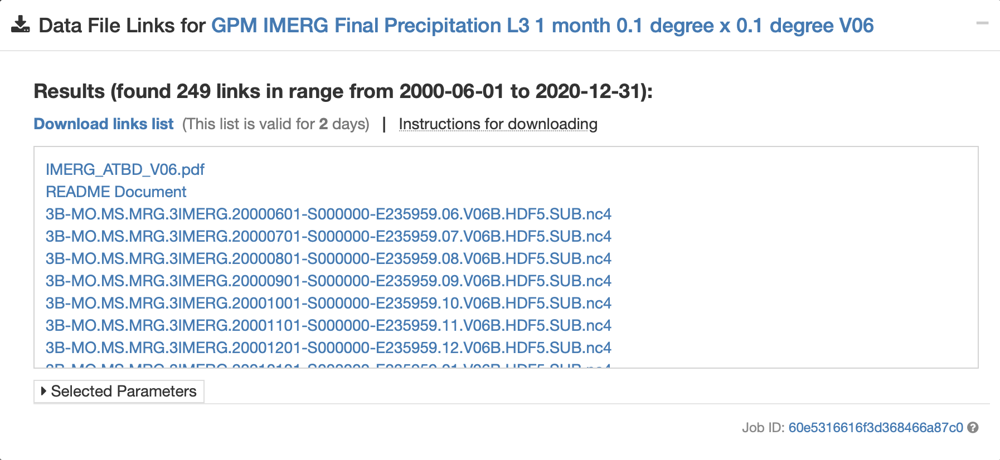
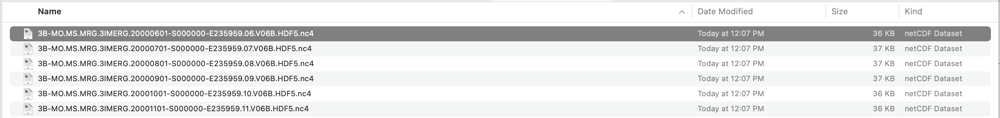
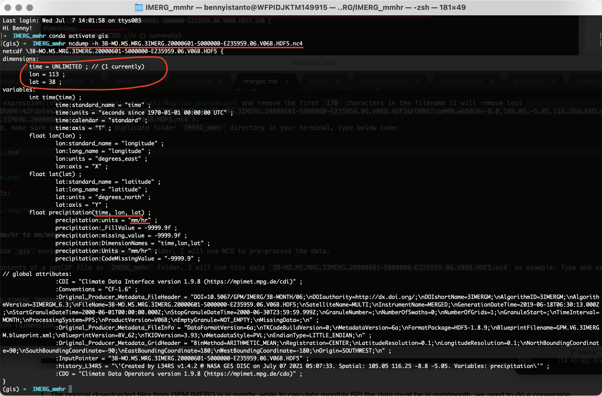
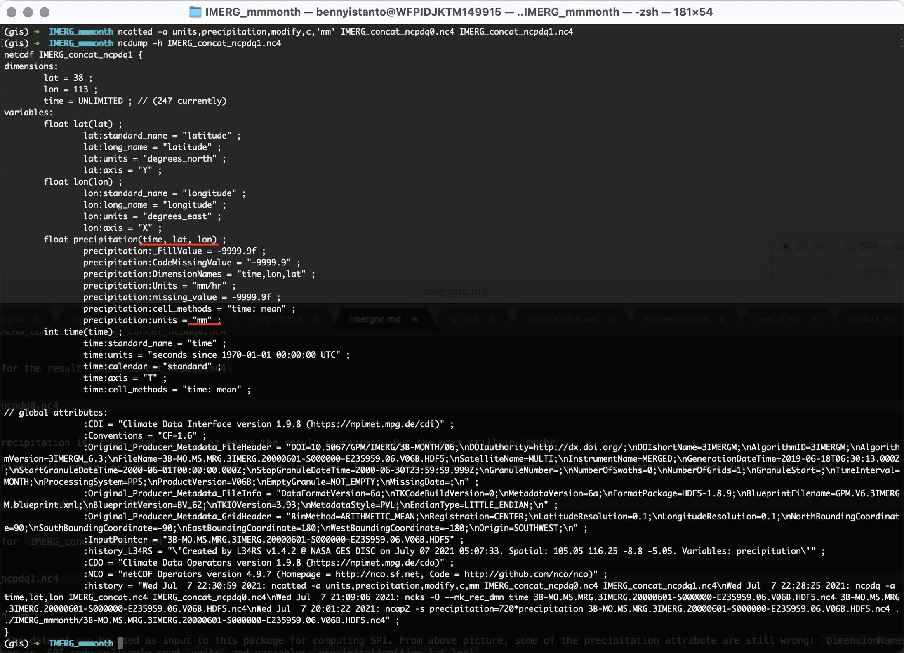
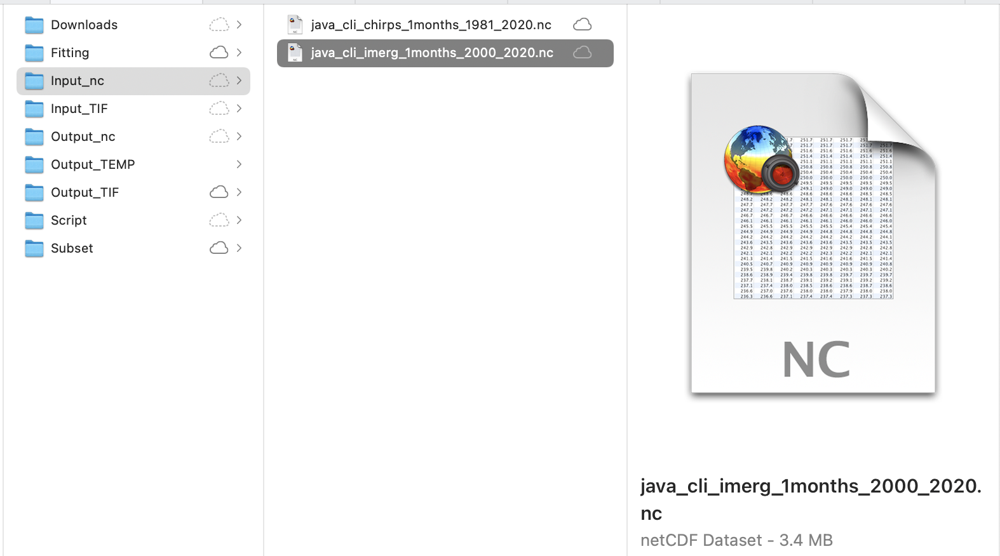

# 3.1. IMERG monthly in netCDF format

## Download monthly IMERG data from GES DISC

- Using a web browser, go to NASA Goddard Earth Sciences (GES) Data and Information Services Center (DISC): [https://disc.gsfc.nasa.gov/](https://disc.gsfc.nasa.gov/)

- Type “IMERG” in the search bar and click on the search icon3

- Select IMERG Version 6 Level 3 data at “monthly” temporal resolution and click on the “Subset/Get Data” icon

	

- Leave the default date range since we want the entire time series

- Under Spatial Subset enter `105.05, -8.8, 116.25, -5.05` This spatial subset is for Java island, Indonesia

- Under Variables select only `precipitation`

- Leave the default parameters under Grid

- Under File Format select "netCDF"

- Click Get Data

	

- Data links windows will popup and you may click "**Download links list**"

	

- You will get a txt file with similar filename like this one `subset_GPM_3IMERGM_06_20210707_044656.txt`

- Move this file into your working directory (in this case I have folder `/Download/IMERG/IMERG_originalfiles` to save the txt file)

- Navigate your terminal to folder `/Downloads/IMERG/IMERG_originalfiles` and type this code to download the data:

``` bash
wget -c -i subset_GPM_3IMERGM_06_20200703_065511.txt`
```


If you are lazy to follow the process of downloading data, for convenience these data are made available on via this link: [https://github.com/wfpidn/SPI/blob/master/Data/IMERG_originalfiles.zip](https://github.com/wfpidn/SPI/blob/master/Data/IMERG_originalfiles.zip)

Once downloaded, unzip `IMERG_originalfiles.zip`


## Rename all the data into friendly filename

- If you check the data in folder `IMERG_originalfiles`, you will find the data with filename something like `HTTP_services.cgi?FILENAME=%2Fdata%2FGPM_L3%2FGPM_3IMERGM.06%2F2000%2F3B-MO.MS.MRG.3IMERG.20000601-S000000-E235959.06.V06B.HDF5&FORMAT=bmM0Lw&BBOX=-8.8,105.05,-5.05,116.25&LABEL=3B-MO.MS.MRG.3IMERG.20000601-S000000-E235959.06.V06B.HDF5.nc4`

	

- I need to rename it all the file into friendly filename like this `3B-MO.MS.MRG.3IMERG.20000601-S000000-E235959.06.V06B.HDF5.nc4`

- If you follow the download process, you may create a duplicate folder and it's contents for `IMERG_originalfiles` and rename it to `IMERG_mmhr` (just in case something happen to you downloaded files). But if you not follow the download process but downloaded `IMERG_originalfiles.zip` folder, you are good.

- I will use [regular expression](https://en.wikipedia.org/wiki/Regular_expression) and remove the first `178` characters in the filename (I will remove text `HTTP_services.cgi?FILENAME=%2Fdata%2FGPM_L3%2FGPM_3IMERGM.06%2F2000%2F3B-MO.MS.MRG.3IMERG.20000601-S000000-E235959.06.V06B.HDF5&FORMAT=bmM0Lw&BBOX=-8.8,105.05,-5.05,116.25&LABEL=` and leaving `3B-MO.MS.MRG.3IMERG.20000601-S000000-E235959.06.V06B.HDF5.nc4`). 
Using `rename` command, make sure you are in newly duplicate folder `IMERG_mmhr` directory in your terminal, type below code: 

``` bash
rename 's/.{178}//g' *.nc4`
```


And below is the result!




## Convert unit from mm/hr to mm/month

Make sure you are inside `gis` environment and `IMERG_mmhr` folder, I will use NCO to pre-process the data. 

- Let's read header contents of a netCDF file in `IMERG_mmhr` folder. I will use this data `3B-MO.MS.MRG.3IMERG.20000601-S000000-E235959.06.V06B.HDF5.nc4` as example. Type and execute below code:

``` bash
ncdump -h 3B-MO.MS.MRG.3IMERG.20000601-S000000-E235959.06.V06B.HDF5.nc4
```

You will get information (dimension, variables and global attribute) about the data.



As you can see above picture, the original downloaded files unit from GPM IMERG is in `mm/hr`, while to calculate monthly SPI, the data must be in `mm/month`. I need to do a conversion process using `ncap2` (arithmatic operator for netCDF files) command by multiplying number of day in month with `24hour`. Example:

- Rainfall value in Month: `JAN`, `MAR`, `MAY`, `JUL`, `AUG`, `OCT`, `DEC` which has `31` days will multiply with `744` to get `mm/month`
- Rainfall value in Month: `APR`, `JUN`, `SEP`, `NOV` which has `30` days will multiply with `720` to get `mm/month`
- Rainfall value in Month: `FEB` in a leap year which has 29 days will multiply with `696` to get `mm/month`
- Rainfall value in Month: `FEB` in a normal year which has 28 days will multiply with `672` to get `mm/month`

To do the calculation, I will use below script to help generate line of codes for converting value of each data from `mm/hr` to `mm/month`

``` bash
while read -r _file; do
    file=$(basename -- "$_file")
    yearmonth=$(echo "$file" | sed -E 's/.*\.3IMERG\.([0-9]{6})[0-9]{2}-.*/\1/')
    mult=$(python - "$yearmonth" <<EOF
import sys, calendar
ym = sys.argv[1]
print(calendar.monthrange(int(ym[:4]), int(ym[4:]))[1] * 24)
EOF
);
    echo ncap2 -s 'precipitation='"$mult"'*precipitation' "$file" ../IMERG_mmmonth/"$file";
done < <(find . -maxdepth 1 -type f -name "*.nc4") > script.sh
```

Paste above code in your Terminal and Enter. You will get a file named `script.sh` as the result.


Then execute below

``` bash
sh script.sh
```


All file inside `IMERG_mmmonth` will have rainfall which show the value in `mm/month`. Let's check file `3B-MO.MS.MRG.3IMERG.20000601-S000000-E235959.06.V06B.HDF5.nc4` in folder `IMERG_mmhr` and `IMERG_mmmonth` using Panoply, see the difference in range of value.

- Monthly rainfall in `mm/hr`

	

- Monthly rainfall in `mm/month`

	

I am aware the unit text still in `mm/hr`, I will explain how to edit it in the next topic.


## Create single netCDF file

Navigate to `IMERG_mmmonth` folder in Terminal. Loop all files in the folder `IMERG_mmmonth` to make `time` the record dimension/variable used for concatenating files using `ncks` command

``` bash
for fl in *.nc4; do ncks -O --mk_rec_dmn time $fl $fl; done
```


Concatenates all `nc4` files in `IMERG_mmmonth` folder into one `nc4` file named `IMERG_concat.nc4` using `ncrcat` command

``` bash
ncrcat -h *.nc4 IMERG_concat.nc4
```


Check the header

``` bash
ncdump -h IMERG_concat.nc4
```


And the variables for precipitation is `time`,`lon`,`lat` but SPI calculation required:

- `lat`,`lon`,`time` or
- `time`,`lat`,`lon`

Let's re-order the variables into `time`,`lat`,`lon` using `ncpdq` command, to be able running the SPI code in Python

``` bash
ncpdq -a time,lat,lon IMERG_concat.nc4 IMERG_concat_ncpdq0.nc4
```


Check again the header for the result `IMERG_concat_ncpdq0.nc4`

``` bash
ncdump -h IMERG_concat_ncpdq0.nc4
```


And the variables for precipitation is `time`,`lat`,`lon`, it means the result is correct. But the unit still in `mm/hr`.

!!! warning
    **Notes on re-ordering process (Case by case)**
    
    After re-ordering the variables, sometimes user experience `lat` or `lon` dimension becomes `UNLIMITED` which is wrong. The `time` dimension should be the `UNLIMITED` dimension.
    
    

    Fortunately you can do this to fix the `lat` or `lon` dimension who becomes `UNLIMITED` using `ncks` command below:
    
    ``` bash
    ncks --fix_rec_dmn lat IMERG_concat_ncpdq0.nc4 -o outfixed.nc4 ; mv outfixed.nc4 IMERG_concat_ncpdq0.nc4
    ```
    
    And to make `UNLIMITED` the `time` dimension again using `ncks` command below:
    
    ``` bash
    ncks --fix_rec_dmn time IMERG_concat_ncpdq0.nc4 -o outfunlim.nc4 ; mv outunlim.nc4 IMERG_concat_ncpdq0.nc4
    ```
    
    If you don't come accross the problem, lat or lon dimension becomes UNLIMITED, then skip above process and go directly to step below.

SPI code does not recognized unit `mm/hr` or `mm/month`, we need to edit into `mm`. To edit the unit attribute names, we will use `ncatted` command, follow below code.

``` bash
ncatted -a units,precipitation,modify,c,'mm' IMERG_concat_ncpdq0.nc4 IMERG_concat_ncpdq1.nc4
```


Check again the header for `IMERG_concat_ncpdq1.nc4`, to make sure everything is correct.

``` bash
ncdump -h IMERG_concat_ncpdq1.nc4
```



And the units already in `mm`

Once this has completed the dataset can be used as input to this package for computing SPI. From above picture, some of the precipitation attribute are still wrong: `DimensionNames` and `Units`. We can leave it as is, SPI code will only read `units` and variables `precipitation(time,lat,lon)`

As the input data preparation is completed, move the file `IMERG_concat_ncpdq1.nc4` to main folder `Input_nc` and rename into `java_cli_imerg_1months_2000_2020.nc`

``` bash
mv IMERG_concat_ncpdq1.nc4 ../../../Input_nc/java_cli_imerg_1months_2000_2020.nc
```


Make sure the file `java_cli_imerg_1months_2000_2020.nc` is available at `Input_nc` folder

