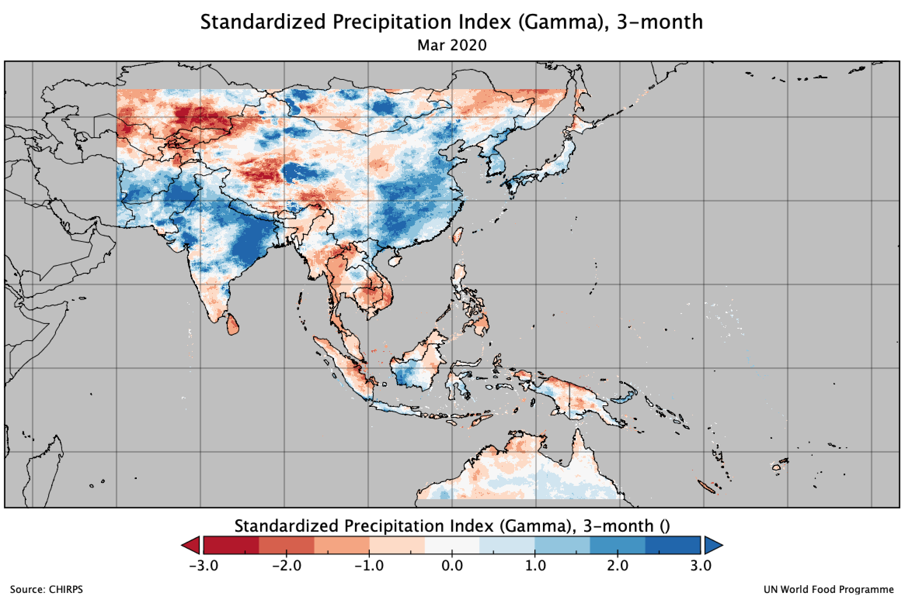

# Satellite-based monitoring of dry and wet conditions using Standardized Precipitation Index (SPI)

The [Standardized Precipitation Index](https://library.wmo.int/doc_num.php?explnum_id=7768) (SPI) analysis is following the training conducted in 28 Jan 2020 by [**NASA ARSET**](https://arset.gsfc.nasa.gov) on **Application of GPM IMERG Reanalysis for Assessing Extreme Dry and Wet Periods**. [https://appliedsciences.nasa.gov/join-mission/training/english/arset-applications-gpm-imerg-reanalysis-assessing-extreme-dry-and-wet](https://appliedsciences.nasa.gov/join-mission/training/english/arset-applications-gpm-imerg-reanalysis-assessing-extreme-dry-and-wet)

The training session from NASA ARSET provided information on how to access and download [**IMERG**](https://gpm.nasa.gov/data/imerg) data, and use it to calculate SPI on defined time scales. Many participant experience several problems and try to raise some question to the developer of `climate-indices` [python package](https://pypi.org/project/climate-indices/) in their [Github](https://github.com/monocongo/climate_indices) page and some also ask in [StackExchange](https://gis.stackexchange.com). I also experience several problem during the training and try to documented the solution by modified some step on their guideline.

In this site, I would like to re-share on how to calculate SPI using NASA ARSET approach and provide alternative way using different data and format. This how-to guideline will use latest version of [Climate Indices in Python](https://github.com/monocongo/climate_indices) software. While NASA ARSET training still used the official release version from [U.S. Drought Portal](https://www.drought.gov/drought/python-climate-indices)

On **[How-to?](../SPI/directory/)** section, you will find step-by-step guideline to calculate SPI, and can try different (data source and format) approach below:

- SPI based on IMERG data in netCDF format (following NASA ARSET training but adjusted in some step)
- SPI based on CHIRPS data in netCDF format
- SPI based on CHIRPS data GeoTIFF  format

## Notes

- This step-by-step guide was tested using Macbook Pro, 2.9 GHz 6-Core Intel Core i9, 32 GB 2400 MHz DDR4, running on macOS Catalina 10.15.7
- And a Windows Server 2019 running in [Parallels Desktop for Mac](https://www.parallels.com/products/desktop/), with [Windows Subsystem for Linux](https://docs.microsoft.com/en-us/windows/wsl/install-on-server) (WSL) installed.
	
	!!! info
	    I will use a standard WSL 2 for Windows 10 as most of Windows user are using Windows 10 for their works. 

## Contact

For further information about this guideline, please contact:

**Benny Istanto** 
Earth Observation and Climate Analyst 

Vulnerability Analysis and Mapping Unit 
UN World Food Programme 
Jakarta, Indonesia 

T. +62-21-5709004 
F. +62-21-5709001 
E. [benny.istanto@wfp.org](mailto:benny.istanto@wfp.org) 

