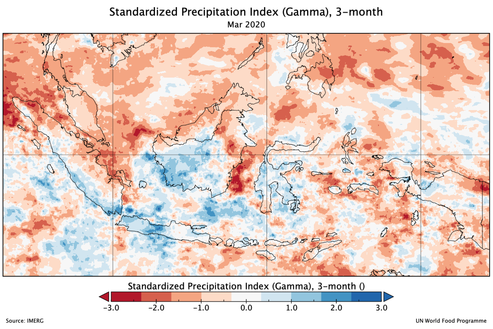
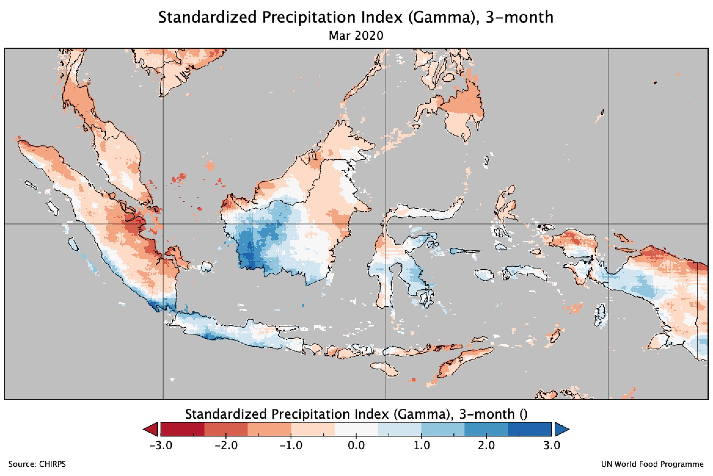
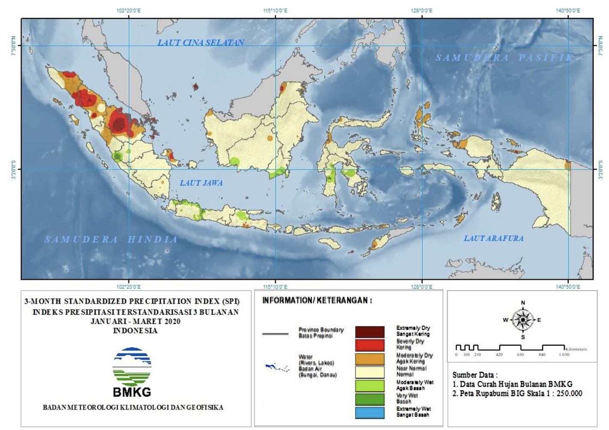
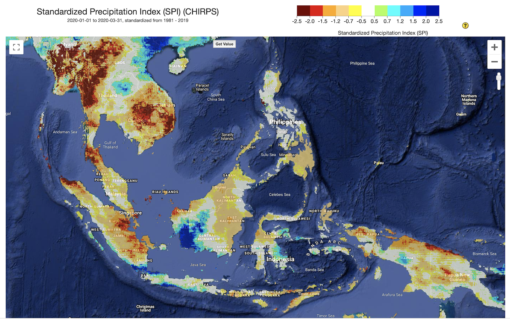

# Example output

Below is the example of SPI calculation using IMERG and CHIRPS data,

**SPI 3-month, March 2020.**

## IMERG

## CHIRPS

**And comparison with SPI generated by:**

## BMKG 

**Indonesia Meteorological, Climatological and Geophysical Agency ([BMKG](https://www.bmkg.go.id/?lang=ID))** regularly produce SPI-3 and published on their website every month [https://www.bmkg.go.id/iklim/indeks-presipitasi-terstandarisasi.bmkg](https://www.bmkg.go.id/iklim/indeks-presipitasi-terstandarisasi.bmkg)

Link for SPI 3-month, March 2020 - [https://www.bmkg.go.id/iklim/indeks-presipitasi-terstandarisasi.bmkg?p=the-standardized-precipitation-index-maret-2020&tag=spi&lang=ID](https://www.bmkg.go.id/iklim/indeks-presipitasi-terstandarisasi.bmkg?p=the-standardized-precipitation-index-maret-2020&tag=spi&lang=ID)

## Climate Engine 

[**Climate Engine**](http://climateengine.org) is a free web application powered by Google Earth Engine that can be used to create on-demand maps and charts from publicly available satellite and climate data using a standard web browser. Climate Engine allows users to analyze and interact with climate and earth observations for decision support related to drought, water use, agricultural, wildfire, and ecology.

One of the product that could generate easily using Climate Engine is SPI. Link [https://climengine.page.link/nTyi](https://climengine.page.link/nTyi)

