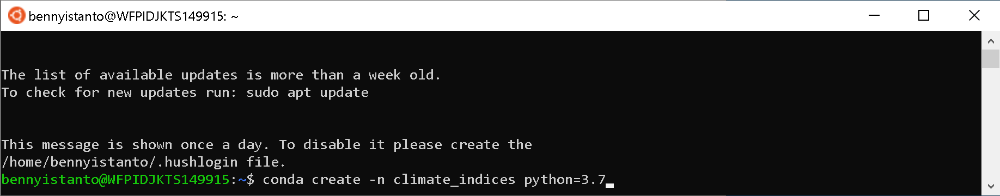
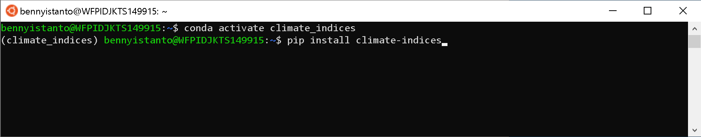
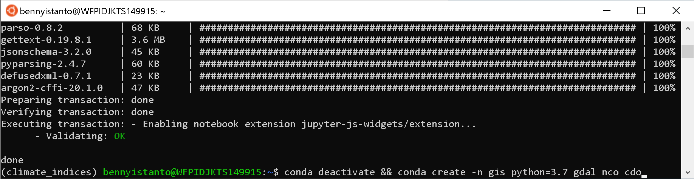
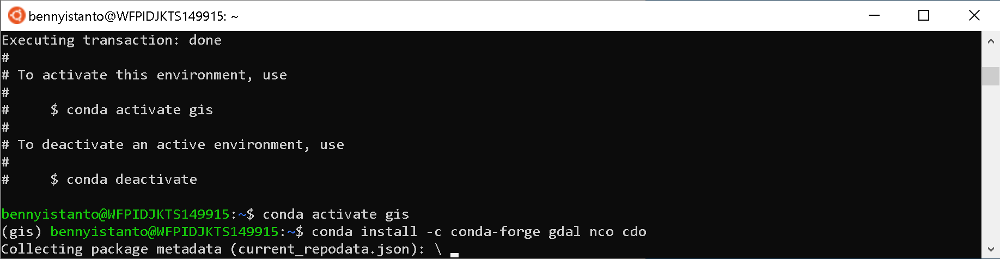

# 2. Configure the python environment

The code for calculating SPI is written in Python 3. It is recommended to use either the **Miniconda3** (minimal Anaconda) or **Anaconda3** distribution. The below instructions will be Anaconda specific (although relevant to any Python virtual environment), and assume the use of a bash shell.

A new Anaconda [environment](https://conda.io/docs/using/envs.html) can be created using the [conda](https://conda.io/docs/) environment management system that comes packaged with Anaconda. In the following examples, I’ll use an environment named `climate_indices` (any environment name can be used instead of `climate_indices`) which will be created and populated with all required dependencies through the use of the provided setup.py file.

!!! note
	This step must **only be done the first time**. Once the environment has been created there is no need to do it again.


- First, open your Terminal (in your macOS/Linux and Ubuntu Linux on WSL), create the Python environment with `python3.7` as default:

```bash
conda create -n climate_indices python=3.7
```



Proceed with `y`

- The environment created can now be ‘activated’:

```bash
conda activate climate_indices
```

- Install [climate-indices](https://pypi.org/project/climate-indices/) package. Once the environment has been activated then subsequent Python commands will run in this environment where the package dependencies for this project are present. Now the package can be added to the environment along with all required modules (dependencies) via [pip](https://pip.pypa.io/en/stable/):

```bash
pip install climate-indices
```



- Install netCDF Operator ([NCO](http://nco.sourceforge.net/)) using `conda` and proceed with `y`.

```bash
conda install -c conda-forge nco
```

- Install Climate Data Operator ([CDO](https://code.mpimet.mpg.de/projects/cdo)) from Max-Planck-Institut für Meteorologie using `conda` and proceed with `y`.

```bash
conda install -c conda-forge cdo
```

- Install `jupyter` and other package using `conda` and proceed with `y`.

```bash
conda install -c conda-forge jupyter numpy netCDF4
```

- Deactivate an active environment `climate_indices` as  I will create a new environment called `gis` to install `gdal` to clip the rainfall data using a shapefile, and proceed with `y`.

```bash
conda deactivate && conda create -n gis python=3.7
```



- The environment created can now be ‘activated’:

```bash
conda activate gis
```

- Install `gdal`, `nco` and `cdo` in `gis` environment and proceed with `y`.

```bash
conda install -c conda-forge gdal nco cdo wget
```

