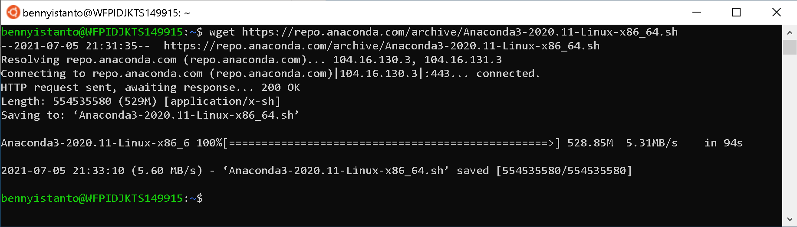
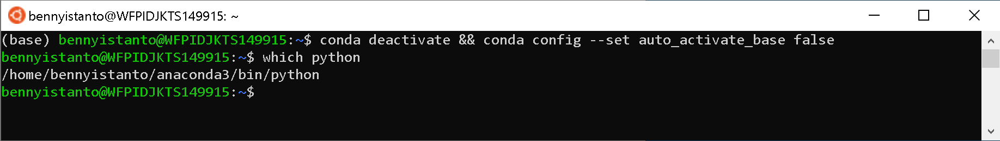

# 1. Software Requirement

If you encounter a problem, please look for a online solution. The installation and configuration described below is mostly performed using a bash shell on macOS. Windows users will need to install and configure a bash shell in order to follow the usage shown below. Try to use [Windows Subsystem for Linux](#enable-the-windows-subsytem-for-linux) for this purpose.


## macOS/Linux

### Installing software for macOS/Linux

If you are new to using Bash refer to the following lessons with Software Carpentry: [http://swcarpentry.github.io/shell-novice/](http://swcarpentry.github.io/shell-novice/)

- If you don't have [**Homebrew**](https://brew.sh), you can install it by pasting below code in your macOS/Linux terminal.

```bash
bin/bash -c "$(curl -fsSL https://raw.githubusercontent.com/Homebrew/install/master/install.sh)"
```

- Install `wget` (for downloading data). Use Hombrew to install it by pasting below code in your macOS terminal.

```bash
brew install wget
```

- Download and install [Panoply Data Viewer](https://www.giss.nasa.gov/tools/panoply/) from [NASA GISS](https://www.giss.nasa.gov/tools/panoply/download/) on your machine: [macOS](https://www.giss.nasa.gov/tools/panoply/download/PanoplyMacOS-4.12.2.dmg) or [Linux](https://www.giss.nasa.gov/tools/panoply/download/PanoplyJ-4.12.2.zip).

- Download and install [Anaconda Python](https://www.anaconda.com/products/individual) on your machine: [macOS](https://repo.anaconda.com/archive/Anaconda3-2020.11-MacOSX-x86_64.pkg) or [Linux](https://repo.anaconda.com/archive/Anaconda3-2020.11-Linux-x86_64.sh).

!!! tip
    Or you can use [Miniconda](https://docs.conda.io/en/latest/miniconda.html): [macOS](https://repo.anaconda.com/miniconda/Miniconda3-latest-MacOSX-x86_64.pkg) or [Linux](https://repo.anaconda.com/miniconda/Miniconda3-latest-Linux-x86_64.sh)


## Windows

### Enable the Windows Subsytem for Linux

!!! tip
    If you are using Windows machine, it's recomended to follow below step. You will experience an error during SPI calculation cause by `NCO` if you use standard Windows 10 and not using Windows Subsytem for Linux. 
    
Reference: [https://docs.microsoft.com/en-us/windows/wsl/install-win10](https://docs.microsoft.com/en-us/windows/wsl/install-win10)

You must first enable the "Windows Subsystem for Linux - WSL" optional feature before installing any Linux distributions on Windows.

Open PowerShell as Administrator (right-click PowerShell) and run:

```PowerShell
dism.exe /online /enable-feature /featurename:Microsoft-Windows-Subsystem-Linux /all /norestart
```

#### Update to WSL 2

**Check requirements for running WSL 2**

To update to WSL 2, you must be running Windows 10.

- For x64 systems: Version 1903 or higher, with Build 18362 or higher.
- For ARM64 systems: Version 2004 or higher, with Build 19041 or higher.
B- uilds lower than 18362 do not support WSL 2. Use the Windows Update Assistant to update your version of Windows.

To check your version and build number, select Windows logo key + R, type winver, select OK. Update to the latest Windows version in the Settings menu.

!!! note 
    If you are running Windows 10 version 1903 or 1909, open "Settings" from your Windows menu, navigate to "Update & Security" and select "Check for Updates". Your Build number must be 18362.1049+ or 18363.1049+, with the minor build # over .1049. Read more: WSL 2 Support is coming to Windows 10 Versions 1903 and 1909. See the troubleshooting instructions.


#### Enable Virtual Machine feature

Before installing WSL 2, you must enable the **Virtual Machine Platform** optional feature. Your machine will require [virtualization capabilities](https://docs.microsoft.com/en-us/windows/wsl/troubleshooting#error-0x80370102-the-virtual-machine-could-not-be-started-because-a-required-feature-is-not-installed) to use this feature.

Open PowerShell as Administrator (right-click PowerShell) and run:

```PowerShell
dism.exe /online /enable-feature /featurename:VirtualMachinePlatform /all /norestart
```

**Restart** your machine to complete the WSL install and update to WSL 2.

#### Download the Linux kernel update package

Download the latest package:

- [WSL2 Linux kernel update package for x64 machines](https://wslstorestorage.blob.core.windows.net/wslblob/wsl_update_x64.msi)

	!!! note
	    If you're using an ARM64 machine, please download the [ARM64 package](https://wslstorestorage.blob.core.windows.net/wslblob/wsl_update_arm64.msi) instead. If you're not sure what kind of machine you have, open Command Prompt or PowerShell and enter: `systeminfo | find "System Type"`. **Caveat:** On non-English Windows versions, you might have to modify the search text, for example, in German it would be `systeminfo | find "Systemtyp"`.

- Run the update package downloaded in the previous step. (Double-click to run - you will be prompted for elevated permissions, select ‘yes’ to approve this installation.)

Once the installation is complete, move on to the next step - setting WSL 2 as your default version when installing new Linux distributions. (Skip this step if you want your new Linux installs to be set to WSL 1).

!!! note
    For more information, read the article [changes to updating the WSL2 Linux kernel](https://devblogs.microsoft.com/commandline/wsl2-will-be-generally-available-in-windows-10-version-2004), available on the [Windows Command Line Blog](https://aka.ms/cliblog).


#### Set WSL 2 as your default version

Open PowerShell and run this command to set WSL 2 as the default version when installing a new Linux distribution:

```PowerShell
wsl --set-default-version 2
```

#### Install your Linux distribution of choice

- Open the [Microsoft Store](https://aka.ms/wslstore) and select your favourite Linux distribution.

	

	Let's focus to use [Ubunto 20.04 LTS](https://www.microsoft.com/store/apps/9n6svws3rx71) distro


- From the distribution's page, select "Get"

	

The first time you launch a newly installed Linux distribution, a console window will open and you'll be asked to wait for a minute or two for files to de-compress and be stored on your PC. All future launches should take less than a second.

You will then need to [create a user account and password for your new Linux distribution](https://docs.microsoft.com/en-us/windows/wsl/user-support).


**CONGRATULATIONS! You've successfully installed and set up a Linux distribution that is completely integrated with your Windows operating system!**


#### Install Windows Terminal (optional)

Windows Terminal enables multiple tabs (quickly switch between multiple Linux command lines, Windows Command Prompt, PowerShell, Azure CLI, etc), create custom key bindings (shortcut keys for opening or closing tabs, copy+paste, etc.), use the search feature, and custom themes (color schemes, font styles and sizes, background image/blur/transparency). [Learn more](https://docs.microsoft.com/en-us/windows/terminal).

[Install Windows Terminal](https://docs.microsoft.com/en-us/windows/terminal/get-started).


#### Set your distribution version to WSL 1 or WSL 2

You can check the WSL version assigned to each of the Linux distributions you have installed by opening the PowerShell command line and entering the command (only available in [Windows Build 18362 or higher](ms-settings:windowsupdate)): `wsl -l -v`

```PowerShell
wsl --list --verbose
```
To set a distribution to be backed by either version of WSL please run:

```PowerShell
wsl --set-version <distribution name> <versionNumber>
```

Make sure to replace `<distribution name>` with the actual name of your distribution and `<versionNumber>` with the number '1' or '2'. You can change back to WSL 1 at anytime by running the same command as above but replacing the '2' with a '1'.

!!! note
    The update from WSL 1 to WSL 2 may take several minutes to complete depending on the size of your targeted distribution. If you are running an older (legacy) installation of WSL 1 from Windows 10 Anniversary Update or Creators Update, you may encounter an update error. Follow these instructions to **uninstall and remove any legacy distributions**.

    If `wsl --set-default-version` results as an invalid command, enter `wsl --help`. If the `--set-default-version` is not listed, it means that your OS doesn't support it and you need to update to version 1903, Build 18362 or higher. If you are on Build 19041 for ARM64, this command may fail when using PowerShell in which case you can use a _Command Prompt_ instead to issue the `wsl.exe` command.

    If you see this message after running the command: `WSL 2 requires an update to its kernel component. For information please visit https://aka.ms/wsl2kernel`. You still need to install the MSI Linux kernel update package.

Additionally, if you want to make WSL 2 your default architecture you can do so with this command:

```PowerShell
wsl --set-default-version 2
```

This will set the version of any new distribution installed to WSL 2.


### Installing software for Windows

If you have a Bash shell already installed on your Windows OS (e.g. Ubuntu Bash) you can use that for the exercise, but it must be a Bash shell

If you are new to using Bash refer to the following lessons with Software Carpentry: [http://swcarpentry.github.io/shell-novice/](http://swcarpentry.github.io/shell-novice/)

1.1. If you don't have [**Homebrew**](https://brew.sh), you can install it by pasting below code in your WSL Ubuntu terminal.

```bash
bin/bash -c "$(curl -fsSL https://raw.githubusercontent.com/Homebrew/install/master/install.sh)"
```

1.2. Install `wget` (for downloading data). Use Hombrew to install it by pasting below code in your WSL Ubuntu  terminal.

```bash
brew install wget
```

1.3. Download and install [Panoply Data Viewer](https://www.giss.nasa.gov/tools/panoply/) from [NASA GISS](https://www.giss.nasa.gov/tools/panoply/download/) on your machine: [Windows](https://www.giss.nasa.gov/tools/panoply/download/PanoplyWin-4.12.2.zip).

1.4. Download and install [Anaconda Python](https://www.anaconda.com/products/individual) on your WSL Ubuntu Linux. : [Ubuntu Linux on WSL](https://repo.anaconda.com/archive/Anaconda3-2020.11-Linux-x86_64.sh).

!!! warning
    `climate-indices` python package used for SPI calculation is rely on [**netCDF Operator (NCO)**](http://nco.sourceforge.net) and NCO only available in macOS/Linux. That's the reason why we will use Anaconda for Linux if you are using Windows machine.

Reference: [https://gist.github.com/kauffmanes/5e74916617f9993bc3479f401dfec7da](https://gist.github.com/kauffmanes/5e74916617f9993bc3479f401dfec7da
)
- Go to [https://repo.anaconda.com/archive/](https://repo.anaconda.com/archive/) to find the list of Anaconda releases
- Select the release you want. I have a 64-bit computer, so I chose the latest release ending in `x86_64.sh`. If I had a 32-bit computer, I'd select the `x86.sh` version. If you accidentally try to install the wrong one, you'll get a warning in the terminal. I chose `Anaconda3-2020.11-Linux-x86_64.sh`.
- From the terminal run `wget https://repo.anaconda.com/archive/[YOUR VERSION]`. Example: 

```bash
wget https://repo.anaconda.com/archive/Anaconda3-2020.11-Linux-x86_64.sh
```



- After download process completed, Run the installation script: `bash Anaconda[YOUR VERSION].sh` 

```bash
bash Anaconda3-2020.11-Linux-x86_64.sh
```

- Read the license agreement and follow the prompts to press Return/Enter to accept. Later will follow with question on accept the license terms, type `yes` and Enter. When asks you if you'd like the installer to prepend it to the path, press Return/Enter to confirm the location. Last question will be about initialize Anaconda3, type `yes` then Enter.
- Close the terminal and reopen it to reload .bash configs. It will automatically activate `base` environment.
- Deactivate `base` environment then set to `false` the confirguration of auto activate the `base` environment by typing

```bash
conda deactivate && conda config --set auto_activate_base false
```

- To test that it worked, `which python` in your Terminal. It should print a path that has anaconda in it. Mine is `/home/bennyistanto/anaconda3/bin/python`. If it doesn't have anaconda in the path, do the next step.

	

- Manually add the Anaconda bin folder to your PATH. To do this, I added `"export PATH=/home/bennyistanto/anaconda3/bin:$PATH"` to the bottom of my `~/.bashrc` file.
- Optionally install [**Visual Studio Code**](https://code.visualstudio.com) when prompted

	!!! info
	    Or you can use [Miniconda](https://docs.conda.io/en/latest/miniconda.html): [Ubuntu Linux on WSL](https://repo.anaconda.com/miniconda/Miniconda3-latest-Linux-x86_64.sh).
