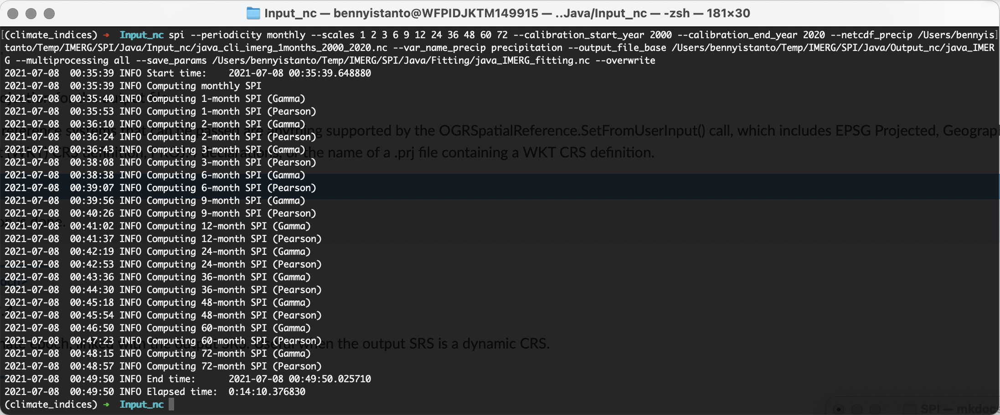
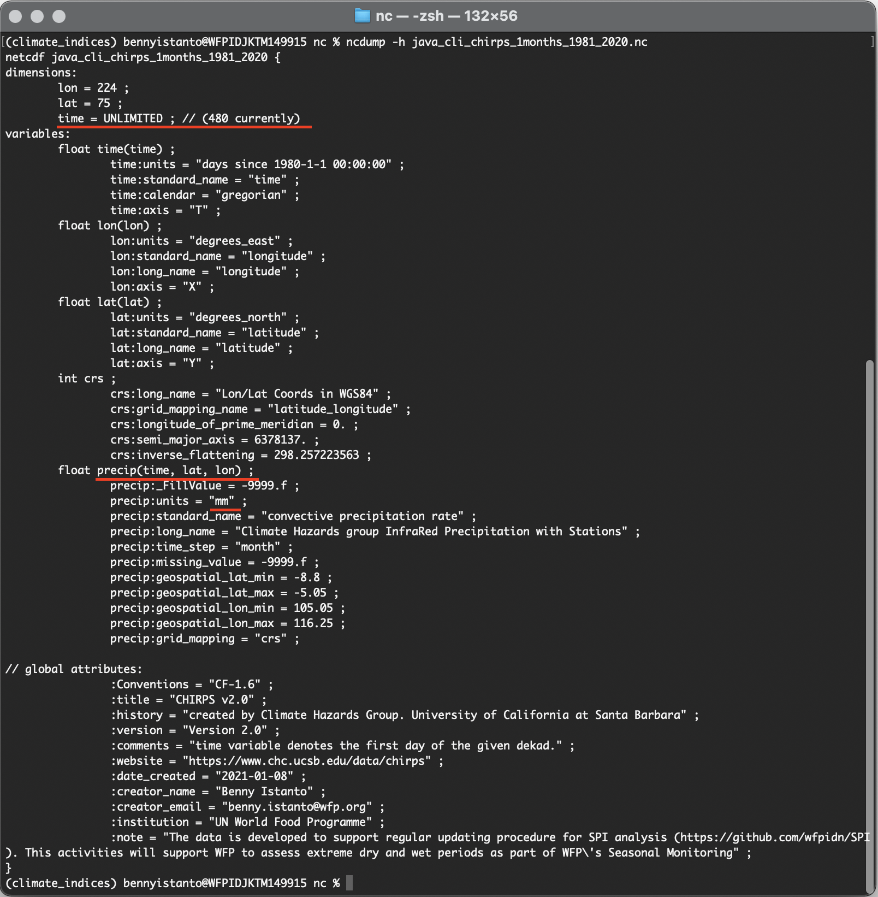
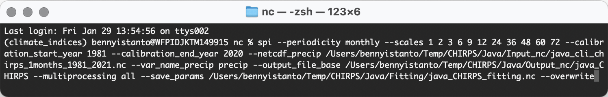
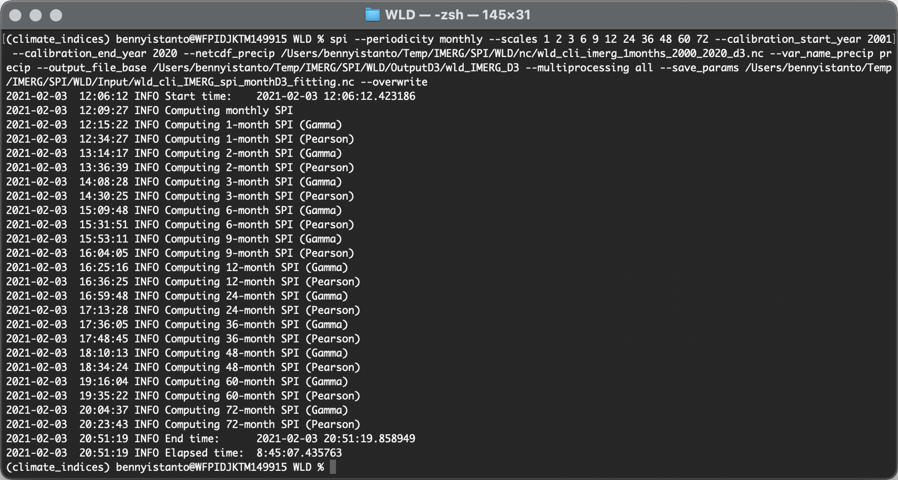

# 4. Calculate SPI

Let's start the calculation!

- Deactivate an active environment `gis` then activate environment `climate_indices` to start working on SPI calculation.

```bash
conda deactivate && conda activate climate_indices
```

!!! note
    Please make sure the input file are following input requirements for SPI

    - Variable name on precipitation `--var_name_precip`, usually IMERG data use `precipitation` as name while CHIRPS using `precip`. To make sure, check using command `ncdump -h file.nc` then adjust it in SPI script if needed.
    - Precipitation unit must be written as `millimeters`, `milimeter`, `mm`, `inches`, `inch` or `in`.
    - Data dimension and order must be written as `lat`, `lon`, `time` (Windows machine required this order) or `time`, `lat`, `lon` (Works tested on Mac/Linux and Linux running on WSL).

## IMERG data

- Navigate your Terminal to folder `Input_nc`

- In order to pre-compute fitting parameters for later use as inputs to subsequent SPI calculations, I can save both gamma and Pearson distribution fitting parameters to NetCDF, and later use this file as input for SPI calculations over the same calibration period.

	Make sure you check below information:

	- Input file `java_cli_imerg_1months_2000_2020.nc` available at `Input_nc` folder. Example: `/Users/bennyistanto/Temp/IMERG/Java/Input_nc/` 
	- Output folder named `Output_nc` to save SPI result is exist in your working directory
	- Output folder named `Fitting` to store fitting result is exist in your working directory
	- Variable name is `precipitation`

In your Terminal, run the following code.

``` bash
spi --periodicity monthly --scales 1 2 3 6 9 12 24 36 48 60 72 --calibration_start_year 2000 --calibration_end_year 2020 --netcdf_precip /Users/bennyistanto/Temp/IMERG/SPI/Java/Input_nc/java_cli_imerg_1months_2000_2020.nc --var_name_precip precipitation --output_file_base /Users/bennyistanto/Temp/IMERG/SPI/Java/Output_nc/java_IMERG --multiprocessing all --save_params /Users/bennyistanto/Temp/IMERG/SPI/Java/Fitting/java_IMERG_fitting.nc --overwrite
```

!!! tip
    Above code is example for calculating SPI 1 to 72-months. It's ok if you think you only need some of them. Example: you are interested to calculate SPI 1 - 3-months, then adjust above code into `--scales 1 2 3` 



The above command will compute SPI (standardized precipitation index, both gamma and Pearson Type III distributions) from an input precipitation dataset (in this case, IMERG precipitation dataset). The input dataset is monthly rainfall accumulation data and the calibration period used will be Jun-2000 through Dec-2020. The index will be computed at `1`,`2`,`3`,`6`,`9`,`12`,`24`,`36`,`48`,`60` and `72-month` timescales. The output files will be <`out_dir>/java_IMERG_spi_gamma_xx.nc`, and `<out_dir>/java_IMERG_spi_pearson_xx.nc`.

The output files will be:

Gamma

1. 1-month: `/Output_nc/java_IMERG_spi_gamma_01.nc`</br>
2. 2-month: `/Output_nc/java_IMERG_spi_gamma_02.nc`</br>
3. 3-month: `/Output_nc/java_IMERG_spi_gamma_03.nc`</br>
4. 6-month: `/Output_nc/java_IMERG_spi_gamma_06.nc`</br>
5. 9-month: `/Output_nc/java_IMERG_spi_gamma_09.nc`</br>
6. 12-month: `/Output_nc/java_IMERG_spi_gamma_12.nc`</br>
7. 24-month: `/Output_nc/java_IMERG_spi_gamma_24.nc`</br>
8. 36-month: `/Output_nc/java_IMERG_spi_gamma_36.nc`</br>
9. 48-month: `/Output_nc/java_IMERG_spi_gamma_48.nc`</br>
10. 60-month: `/Output_nc/java_IMERG_spi_gamma_60.nc`</br>
11. 72-month: `/Output_nc/java_IMERG_spi_gamma_72.nc`</br>

Pearson

1. 1-month: `/Output_nc/java_IMERG_spi_pearson_01.nc`</br>
2. 2-month: `/Output_nc/java_IMERG_spi_pearson_02.nc`</br>
3. 3-month: `/Output_nc/java_IMERG_spi_pearson_03.nc`</br>
4. 6-month: `/Output_nc/java_IMERG_spi_pearson_06.nc`</br>
5. 9-month: `/Output_nc/java_IMERG_spi_pearson_09.nc`</br>
6. 12-month: `/Output_nc/java_IMERG_spi_pearson_12.nc`</br>
7. 24-month: `/Output_nc/java_IMERG_spi_pearson_24.nc`</br>
8. 36-month: `/Output_nc/java_IMERG_spi_pearson_36.nc`</br>
9. 48-month: `/Output_nc/java_IMERG_spi_pearson_48.nc`</br>
10. 60-month: `/Output_nc/java_IMERG_spi_pearson_60.nc`</br>
11. 72-month: `/Output_nc/java_IMERG_spi_pearson_72.nc`</br>

Parallelization will occur utilizing all CPUs.


## CHIRPS data

- To make sure everything is correct and following above specifications, in your Terminal - navigate to your directory where you save `java_cli_chirps_1months_1981_2020.nc` file: `Input_nc`. Then type

```bash
ncdump -h java_cli_chirps_1months_1981_2020.nc
```



From above picture, I can say:

- [x] Time dimension is enabled, `480` is total months from Jan 1981 to Dec 2020
- [x] Data dimension and order are following the specification `time`, `lat`, `lon`
- [x] The unit is in `mm`

So, everything is correct and I am ready to calculate SPI. Make sure in your Terminal still inside `climate_indices` environment.

Other requirements and options related to the indices calculation, please follow https://climate-indices.readthedocs.io/en/latest/#indices-processing

- In order to pre-compute fitting parameters for later use as inputs to subsequent SPI calculations I can save both gamma and Pearson distribution fitting parameters to NetCDF, and later use this file as input for SPI calculations over the same calibration period.

	Make sure you check below information:

	- Input file `java_cli_chirps_1months_1981_2021.nc` available at `Input_nc` folder. Example: `/Users/bennyistanto/Temp/CHIRPS/Java/Input_nc/` 
	- Output folder named `Output_nc` to save SPI result is exist in your working directory
	- Output folder named `Fitting` to store fitting result is exist in your working directory
	- Variable name is `precip`

In your Terminal, run the following code.

``` bash
spi --periodicity monthly --scales 1 2 3 6 9 12 24 36 48 60 72 --calibration_start_year 1981 --calibration_end_year 2020 --netcdf_precip /Users/bennyistanto/Temp/CHIRPS/SPI/Java/Input_nc/java_cli_chirps_1months_1981_2021.nc --var_name_precip precip --output_file_base /Users/bennyistanto/Temp/CHIRPS/SPI/Java/Output_nc/java_CHIRPS --multiprocessing all --save_params /Users/bennyistanto/Temp/CHIRPS/SPI/Java/Fitting/java_CHIRPS_fitting.nc --overwrite
```

!!! tip
    Above code is example for calculating SPI 1 to 72-months. It's ok if you think you only need some of them. Example: you are interested to calculate SPI 1 - 3-months, then adjust above code into `--scales 1 2 3` 



The above command will compute SPI (standardized precipitation index, both gamma and Pearson Type III distributions) from an input precipitation dataset (in this case, CHIRPS precipitation dataset). The input dataset is monthly rainfall accumulation data and the calibration period used will be Jan-1981 through Dec-2020. The index will be computed at `1`,`2`,`3`,`6`,`9`,`12`,`24`,`36`,`48`,`60` and `72-month` timescales. The output files will be <`out_dir>/java_CHIRPS_spi_gamma_xx.nc`, and `<out_dir>/java_CHIRPS_spi_pearson_xx.nc`.

The output files will be:

Gamma

1. 1-month: `/Output_nc/java_CHIRPS_spi_gamma_01.nc`</br>
2. 2-month: `/Output_nc/java_CHIRPS_spi_gamma_02.nc`</br>
3. 3-month: `/Output_nc/java_CHIRPS_spi_gamma_03.nc`</br>
4. 6-month: `/Output_nc/java_CHIRPS_spi_gamma_06.nc`</br>
5. 9-month: `/Output_nc/java_CHIRPS_spi_gamma_09.nc`</br>
6. 12-month: `/Output_nc/java_CHIRPS_spi_gamma_12.nc`</br>
7. 24-month: `/Output_nc/java_CHIRPS_spi_gamma_24.nc`</br>
8. 36-month: `/Output_nc/java_CHIRPS_spi_gamma_36.nc`</br>
9. 48-month: `/Output_nc/java_CHIRPS_spi_gamma_48.nc`</br>
10. 60-month: `/Output_nc/java_CHIRPS_spi_gamma_60.nc`</br>
11. 72-month: `/Output_nc/java_CHIRPS_spi_gamma_72.nc`</br>

Pearson

1. 1-month: `/Output_nc/java_CHIRPS_spi_pearson_01.nc`</br>
2. 2-month: `/Output_nc/java_CHIRPS_spi_pearson_02.nc`</br>
3. 3-month: `/Output_nc/java_CHIRPS_spi_pearson_03.nc`</br>
4. 6-month: `/Output_nc/java_CHIRPS_spi_pearson_06.nc`</br>
5. 9-month: `/Output_nc/java_CHIRPS_spi_pearson_09.nc`</br>
6. 12-month: `/Output_nc/java_CHIRPS_spi_pearson_12.nc`</br>
7. 24-month: `/Output_nc/java_CHIRPS_spi_pearson_24.nc`</br>
8. 36-month: `/Output_nc/java_CHIRPS_spi_pearson_36.nc`</br>
9. 48-month: `/Output_nc/java_CHIRPS_spi_pearson_48.nc`</br>
10. 60-month: `/Output_nc/java_CHIRPS_spi_pearson_60.nc`</br>
11. 72-month: `/Output_nc/java_CHIRPS_spi_pearson_72.nc`</br>

Parallelization will occur utilizing all CPUs.


## Time processing

For small area of interest, the calculation will fast and don’t take much time. Below is one of example if you processed bigger area:

- Monthly IMERG data, global coverage 180W - 180E, 60N - 60S, 0.1 deg spatial resolution. It takes almost 9-hours to process SPI 1-72 months.
	
	

	Output gamma and pearson file [https://github.com/wfpidn/SPI/blob/master/Data/Output_nc](https://github.com/wfpidn/SPI/blob/master/Data/Output_nc)

	Fitting file [https://github.com/wfpidn/SPI/blob/master/Data/Fitting](https://github.com/wfpidn/SPI/blob/master/Data/Fitting)