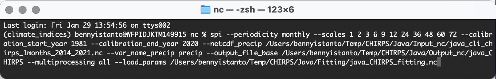

# 5. Updating procedure when new data is available


What if the new data is coming (Jan 2021)? Should I re-run again for the whole periods, 1981 to date? That's not practical as it requires large storage and time processing if you do for bigger coverage (country or regional analysis).

So far, updating the SPI process is easy if I used CHIRPS in GeoTIFF format. Below are some reason:

- Downloading new CHIRPS data in [netCDF](https://data.chc.ucsb.edu/products/CHIRPS-2.0/global_monthly/netcdf/) is painful, because we I to download whole package data (6.4 GB and start from Jan 1981 to date) eventhough I only need the latest month.

- CHIRPS data in [GeoTIFF](https://data.chc.ucsb.edu/products/CHIRPS-2.0/global_monthly/tifs/) provides 1 month 1 GeoTIFF file, only take what you need!

- IMERG included data over the sea, and easiest way to clipped netCDF data is using bounding box. This approach will not have a problem if all of our area interest is in land.

Updating SPI up to SPI-72, I should have data at least 6 years back (2014) from the latest (Jan 2021). In order to avoid computation for the whole periods (1981-2021), I will process data data only for year 2014 to 2021.

After that, I continue the process following Step 3 to do conversion process to netCDF format from bunch of GeoTIFF file in a folder with time dimension enabled.

Step 4 demonstrates how distribution fitting parameters can be saved as NetCDF. This fittings NetCDF can then be used as pre-computed variables in subsequent SPI computations. Initial command computes both distribution fitting values and SPI for various month scales.

The distribution fitting variables are written to the file specified by the `--save_params` option.

The below command also computes SPI but instead of computing the distribution fitting values it loads the pre-computed fitting values from the NetCDF file specified by the `--load_params` option.

See below code:

``` bash
spi --periodicity monthly --scales 1 2 3 6 9 12 24 36 48 60 72 --calibration_start_year 1981 --calibration_end_year 2020 --netcdf_precip /Users/bennyistanto/Temp/CHIRPS/Java/Input_nc/java_cli_chirps_1months_2014_2021.nc --var_name_precip precip --output_file_base /Users/bennyistanto/Temp/CHIRPS/Java/Output_nc/java_CHIRPS --multiprocessing all --load_params /Users/bennyistanto/Temp/CHIRPS/Java/Fitting/java_CHIRPS_fitting.nc
```

