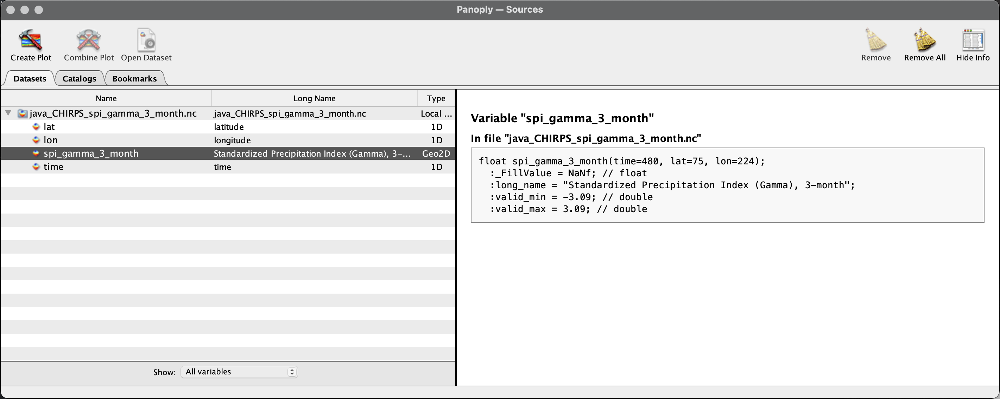
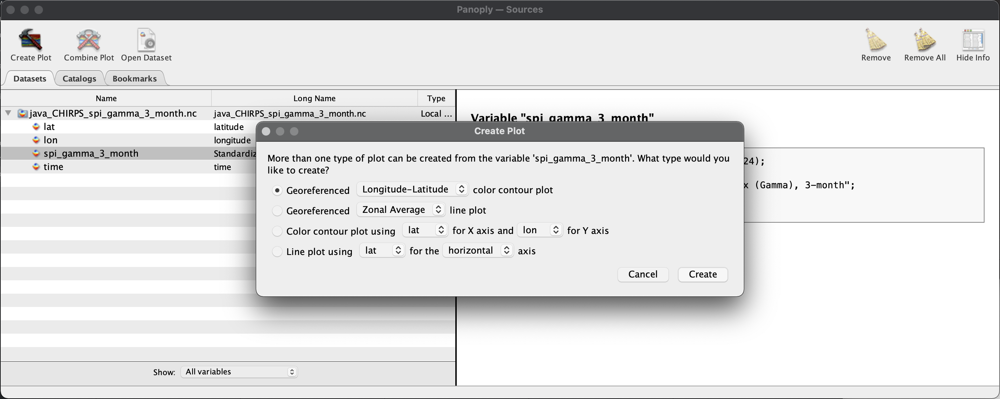
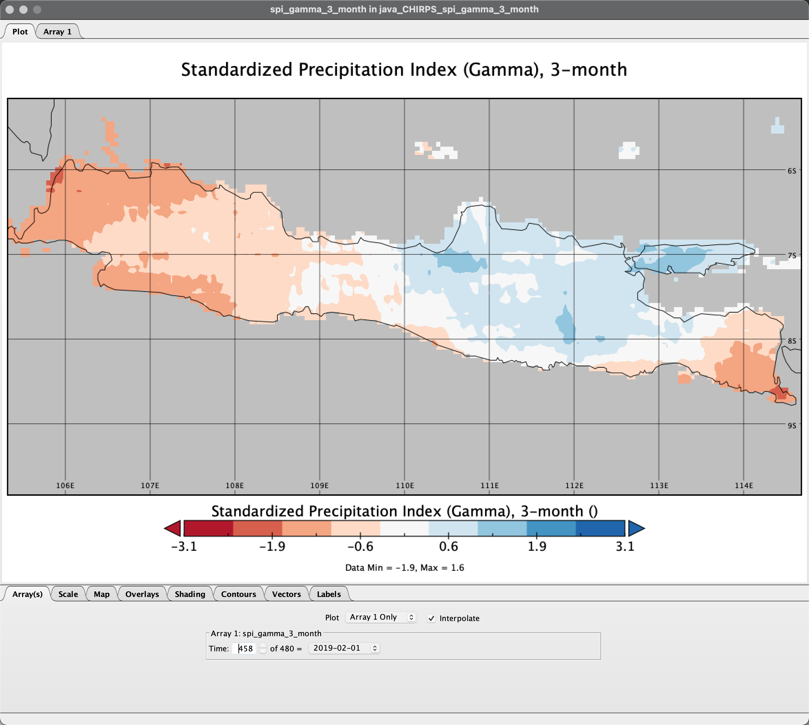

# 6. Visualize the result using Panoply

Let see the result.

- From the `Output_nc` directory, right-click file `java_CHIRPS_spi_gamma_3_month.nc` and Open With Panoply.

	If you are not following the tutorial but interested to see the file, you can download this file from this link: [https://on.istan.to/2MhVnTP](https://on.istan.to/2MhVnTP) 

	

- From the Datasets tab select spi_gamma_3_month and click Create Plot

	

- In the Create Plot window select option Georeferenced Longitude-Latitude.

- When the Plot window opens:

	- Array tab: Change the time into `469` to view data on `Jan 2020`
	- Scale tab: Change value on Min `-3`, Max `3`, Major `6`, Color Table `CB_RdBu_09.cpt`
	- Map tab: Change value on Center on Lon `110.0` Lat `-7.5`, then Zoom in the map through menu-editor Plot > Zoom - Plot In few times until Indonesia appear proportionally. Set grid spacing `2.0` and Labels on every grid lines.
	- Overlays tab: Change `Overlay 1` to `MWDB_Coasts_Countries_1.cnob`

	